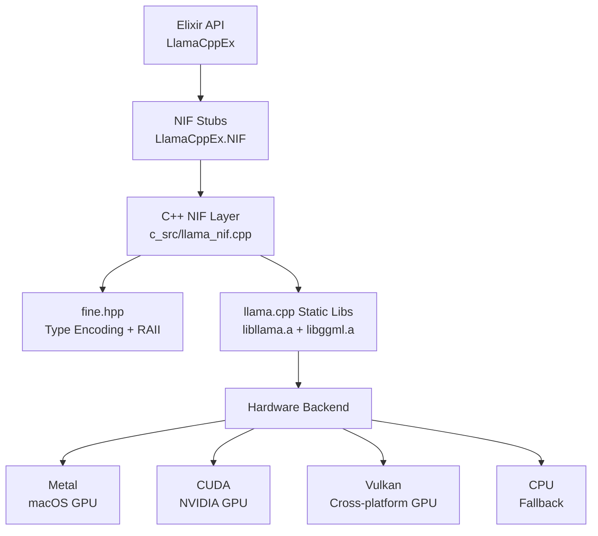
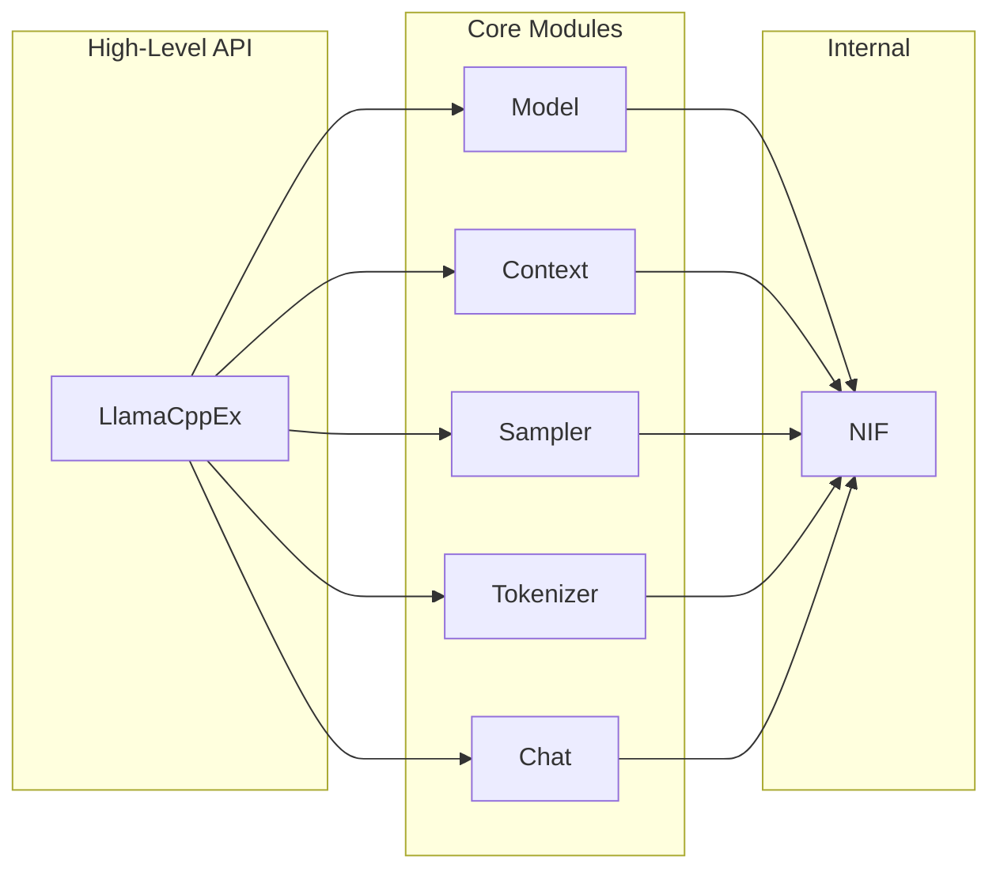
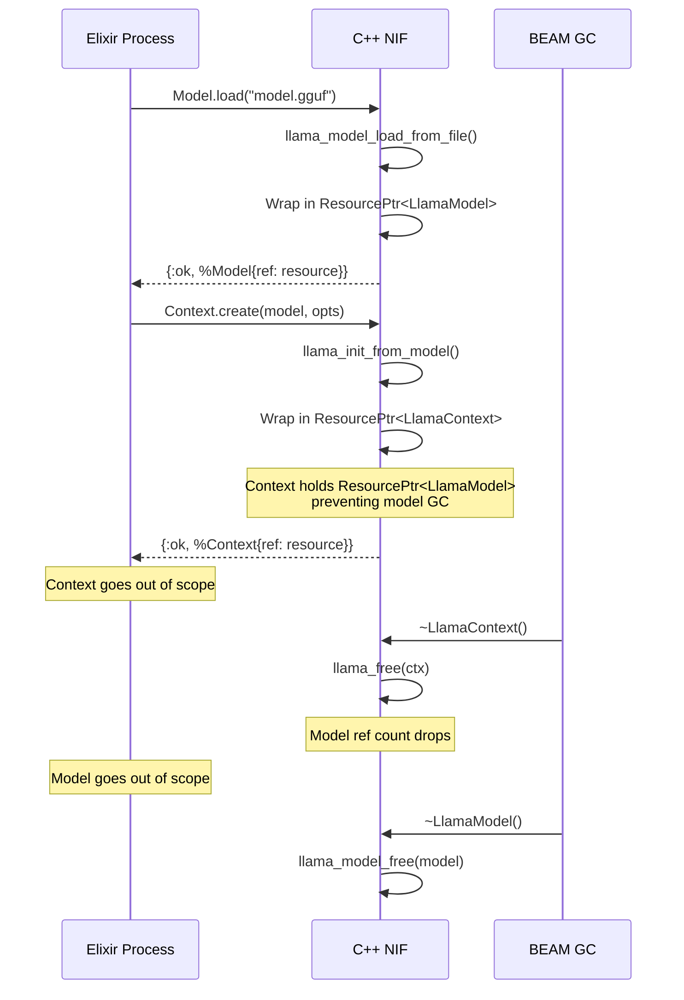
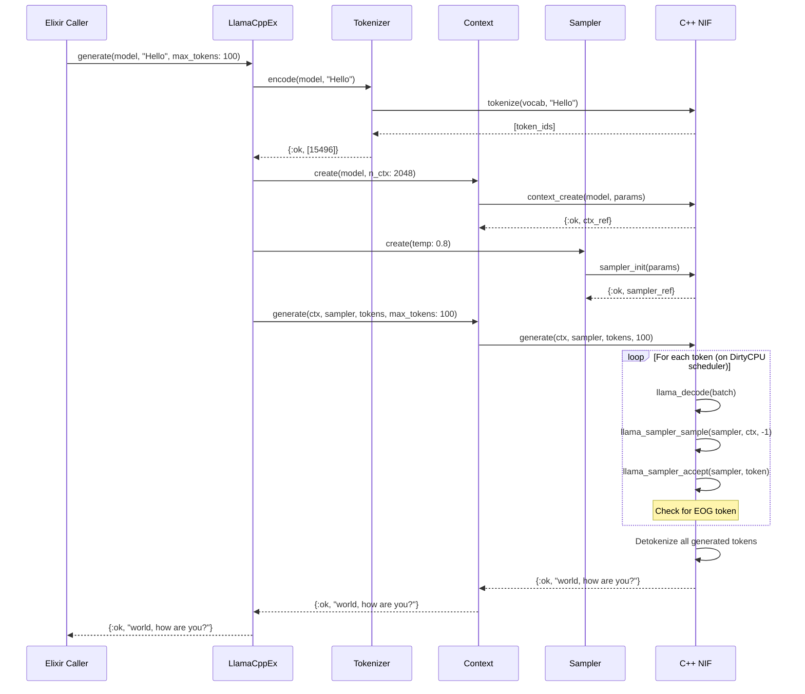
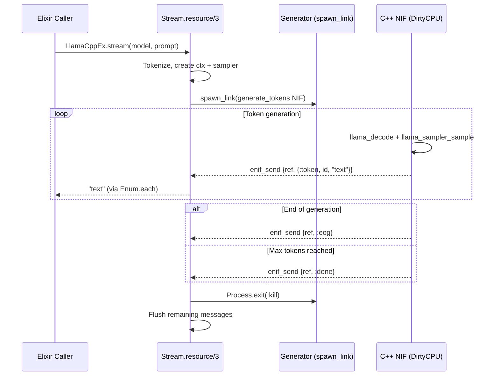
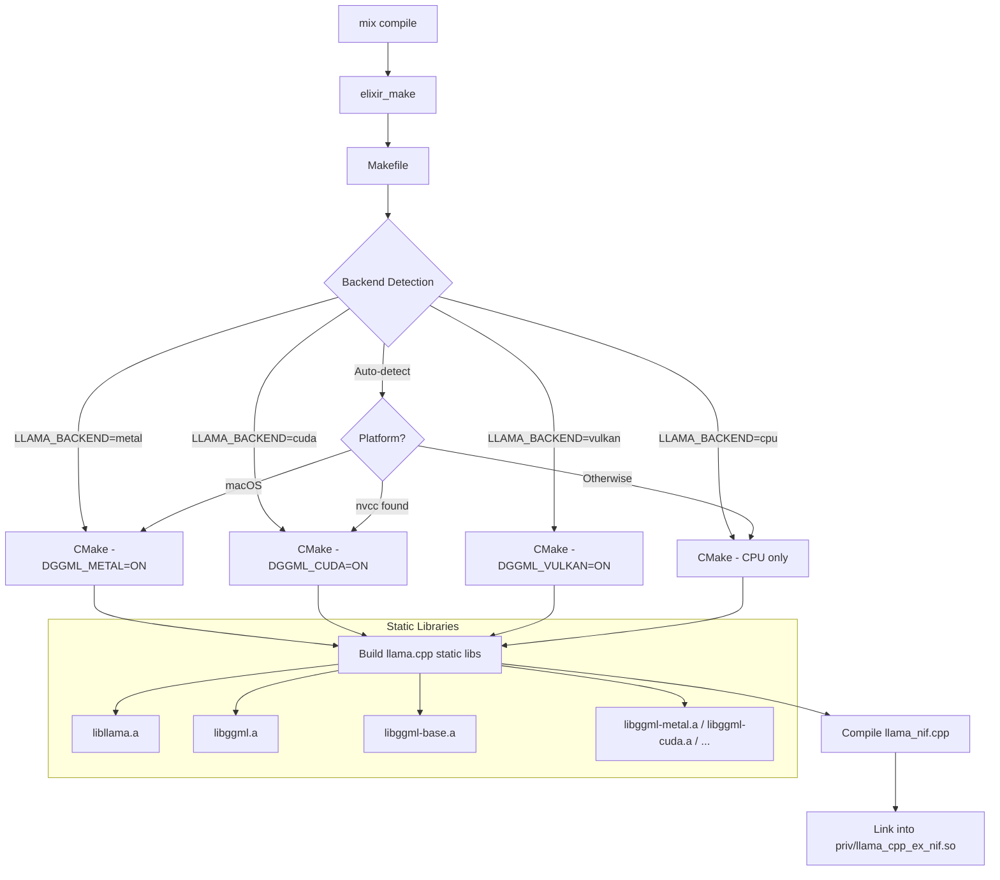
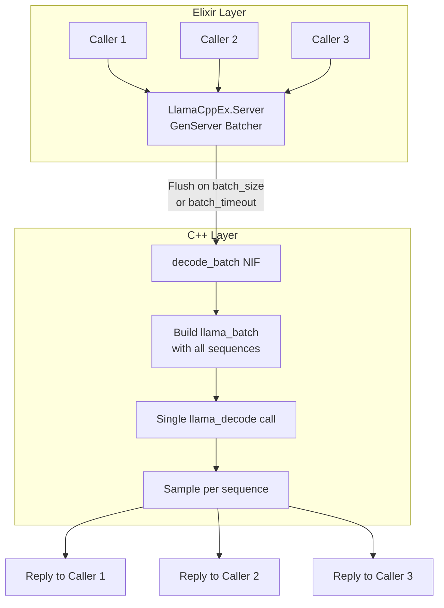
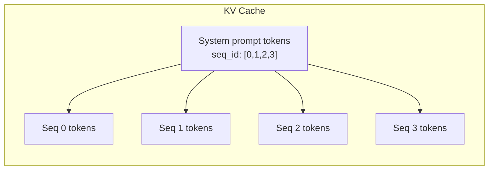
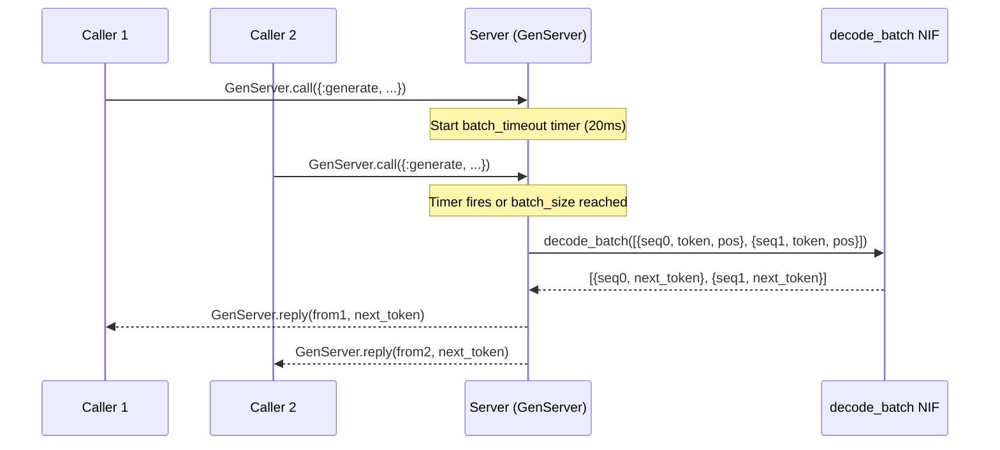

# Architecture

## Overview

LlamaCppEx provides Elixir bindings for [llama.cpp](https://github.com/ggml-org/llama.cpp) via C++ NIFs (Native Implemented Functions). The design follows the same pattern used by production Elixir ML libraries like EXLA and Evision.

## Layer Diagram



## Module Structure



## Resource Lifecycle

All C++ objects are wrapped in RAII classes registered with the BEAM via `fine`. When the Elixir process holding a reference is garbage collected, the C++ destructor runs automatically.



## Resource Types

| C++ Wrapper | Wraps | Destructor | Prevents GC of |
|---|---|---|---|
| `LlamaModel` | `llama_model*` | `llama_model_free()` | - |
| `LlamaContext` | `llama_context*` | `llama_free()` | LlamaModel |
| `LlamaSampler` | `llama_sampler*` | `llama_sampler_free()` | - |

The Context holds a `ResourcePtr<LlamaModel>` to prevent the model from being garbage collected while the context is alive. This is critical since `llama_context` internally references the model's weights.

## NIF Scheduler Assignment

NIFs are assigned to the appropriate scheduler based on their execution characteristics:

| NIF | Scheduler | Reason |
|---|---|---|
| `model_load` | DirtyIO | Reads multi-GB file from disk |
| `context_create` | DirtyCPU | GPU memory allocation |
| `decode` | DirtyCPU | Forward pass (compute-heavy) |
| `generate` | DirtyCPU | Tight decode+sample loop |
| `generate_tokens` | DirtyCPU | Streaming decode+sample loop |
| `tokenize`, `detokenize` | Normal | Fast string operations |
| `sampler_*` | Normal | Lightweight operations |
| `model_*` (introspection) | Normal | Simple field reads |

**Why dirty schedulers?** Regular NIF calls must return within ~1ms to avoid blocking BEAM schedulers. Model loading and inference can take seconds to minutes. Dirty schedulers provide dedicated OS threads for these long-running operations without impacting BEAM responsiveness.

## Text Generation Flow



## Streaming Flow

Streaming uses `enif_send` to send tokens from the dirty scheduler to the calling Elixir process:



Key design decisions:
- Generator runs in a `spawn_link`ed process on a dirty scheduler
- Messages use a unique `ref` to prevent cross-stream interference
- `Stream.resource/3` provides lazy enumeration with proper cleanup
- Early termination (e.g., `Enum.take/2`) kills the generator and flushes messages

## Build System



## Batching Architecture (Planned - Phase 3)

For serving multiple concurrent users, llama.cpp supports batched inference where multiple sequences share a single forward pass:



### Why Batching Matters

- **Prefill** (prompt processing): Already GPU-efficient, compute-bound
- **Decode** (token generation): Memory-bandwidth-bound, GPU utilization 10-30%
- **Batching**: Converts N serial matrix-vector ops into one matrix-matrix multiply

### How `llama_batch` Enables Multi-Sequence Batching

Each token in a batch carries its sequence ID. Tokens only attend to tokens with the same sequence ID, enabling independent sequences to share a forward pass:

```
llama_batch:
  token[0] = {id: 1234, pos: 42, seq_id: [0], logits: true}   # Sequence 0
  token[1] = {id: 5678, pos: 18, seq_id: [1], logits: true}   # Sequence 1
  token[2] = {id: 9012, pos: 31, seq_id: [2], logits: true}   # Sequence 2
```

### Shared System Prompt

Tag prompt tokens with ALL sequence IDs to cache the system prompt once and share it across all sequences:



### GenServer Batcher Design



## File Map

```
llama_cpp_ex/
├── mix.exs                          # Project config, deps, Hex package metadata
├── Makefile                         # CMake + NIF build system
├── vendor/llama.cpp/                # Git submodule (pinned to release)
├── c_src/llama_cpp_ex/
│   ├── llama_nif.h                  # RAII wrappers (LlamaModel, LlamaContext, LlamaSampler)
│   └── llama_nif.cpp                # All NIF implementations (~560 lines)
├── lib/
│   ├── llama_cpp_ex.ex              # High-level API: generate, stream, chat
│   └── llama_cpp_ex/
│       ├── nif.ex                   # @on_load + NIF stubs
│       ├── model.ex                 # Model loading + introspection
│       ├── context.ex               # Inference context with KV cache
│       ├── sampler.ex               # Sampling chain configuration
│       ├── tokenizer.ex             # Text <-> token conversion
│       └── chat.ex                  # Chat template formatting
├── priv/                            # Build output (.so / .dylib)
├── docs/                            # Architecture docs + ADRs
└── test/
    └── llama_cpp_ex_test.exs        # 11 tests (2 unit + 9 model-dependent)
```
